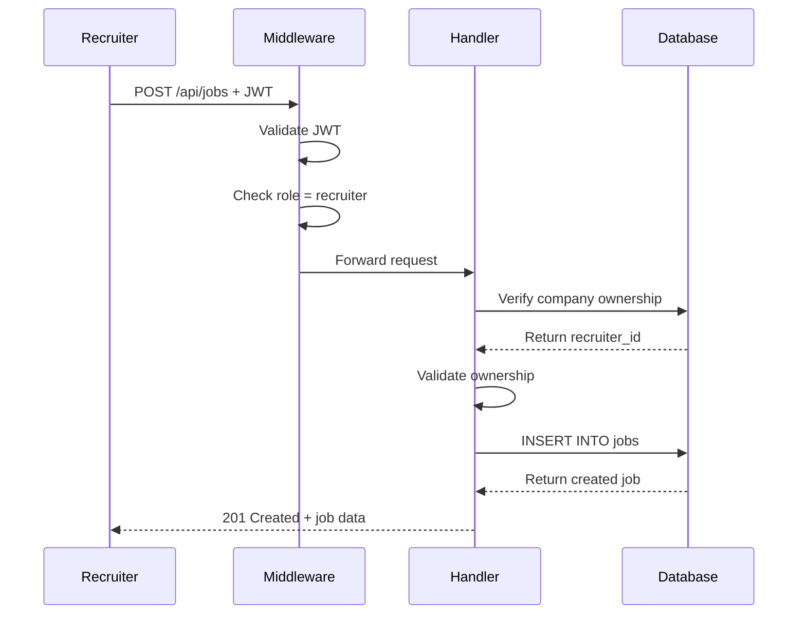
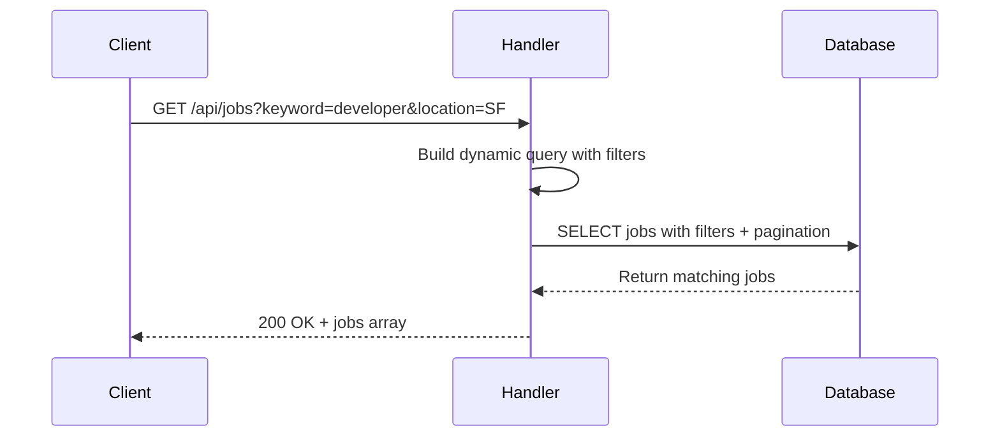
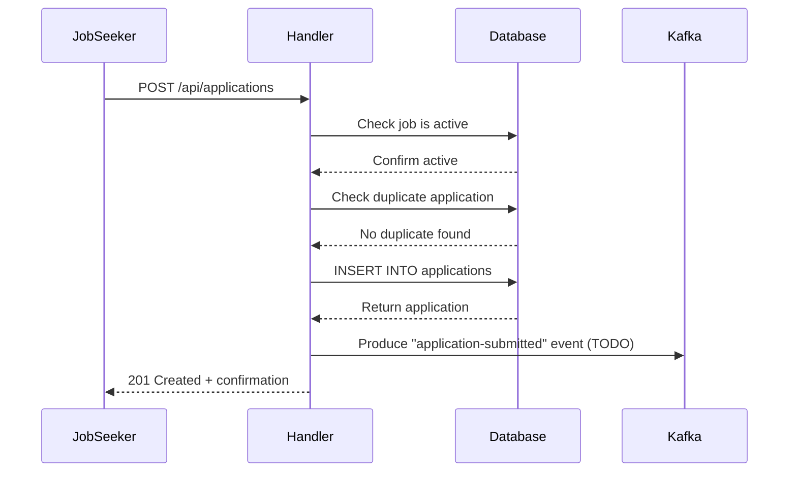

# Job Service Documentation

## Overview

The Job Service is a comprehensive microservice for managing job postings, company profiles, and job applications. It supports markdown-formatted job descriptions, advanced search filters, and role-based access control for recruiters and job seekers.

---

## Features

### ✅ Company Management (Recruiters Only)
- Create company profiles
- Update company information
- Delete companies
- View company details
- Ownership validation

### ✅ Job Postings (Recruiters + Public)
- **Recruiters**: Create, update, delete jobs
- **Public**: Search jobs with filters, view job details
- **Markdown Support**: Rich job descriptions
- **Search Filters**: Keyword, location, job type, work location
- **Pagination**: Efficient browsing

### ✅ Applications (Job Seekers + Recruiters)
- **Job Seekers**: Apply to jobs, view own applications
- **Recruiters**: View applications for owned jobs, update application status
- **Duplicate Prevention**: One application per job per user
- **Status Tracking**: pending → viewed → shortlisted → interviewed → offered/rejected

---

## Tech Stack

| Component | Technology |
|-----------|-----------|
| **Framework** | Gin (Go web framework) |
| **Database** | PostgreSQL (Neon DB) |
| **Authentication** | JWT middleware |
| **Array Support** | lib/pq for PostgreSQL arrays |
| **Authorization** | Role-based (job seeker vs recruiter) |

---

## API Endpoints

### Public Endpoints (No Auth Required)

#### GET /api/jobs
Search jobs with filters

**Query Parameters:**
- `keyword` - Search in title and description
- `location` - Filter by location (case-insensitive)
- `job_type` - Filter by type (full-time, part-time, contract, internship)
- `work_location` - Filter by work location (remote, onsite, hybrid)
- `page` - Page number (default: 1)
- `limit` - Items per page (default: 20, max: 100)

**Response:**
```json
{
  "jobs": [...],
  "page": 1,
  "limit": 20,
  "count": 15
}
```

#### GET /api/jobs/:id
Get job details with company information

#### GET /api/jobs/company/:companyId
Get all active jobs for a specific company

---

### Protected Endpoints (Require JWT)

#### Company Endpoints (Recruiters Only)

**POST /api/companies**
Create new company

**Request:**
```json
{
  "name": "Tech Innovators Inc",
  "description": "Leading AI company",
  "website": "https://example.com",
  "logo_url": "https://cloudinary.../logo.png"
}
```

**PUT /api/companies/:id**
Update company (ownership required)

**DELETE /api/companies/:id**
Delete company (ownership required)

**GET /api/companies/:id**
Get company details (any authenticated user)

---

#### Job Endpoints

**POST /api/jobs** (Recruiters Only)
Create job posting with markdown description

**Request:**
```json
{
  "title": "Senior Full Stack Developer",
  "description": "# About the Role\n\n## Responsibilities\n- Build scalable APIs\n- Lead frontend team",
  "salary": "$120,000 - $150,000",
  "location": "San Francisco, CA",
  "job_type": "full-time",
  "work_location": "hybrid",
  "openings": 2,
  "required_skills": ["JavaScript", "React", "Node.js"],
  "company_id": "uuid-of-company"
}
```

**PUT /api/jobs/:id** (Recruiters Only)
Update job (ownership required)

**DELETE /api/jobs/:id** (Recruiters Only)
Delete job (ownership required)

**GET /api/jobs/:id/applications** (Recruiters Only)
View all applications for a job

---

#### Application Endpoints

**POST /api/applications**
Apply to a job (Job Seekers)

**Request:**
```json
{
  "job_id": "uuid",
  "email": "john@example.com",
  "resume_url": "https://cloudinary.../resume.pdf",
  "cover_letter": "I am excited to apply...",
  "subscribed": true
}
```

**GET /api/applications/my**
Get all applications by authenticated user

**PUT /api/applications/:id/status** (Recruiters Only)
Update application status

**Request:**
```json
{
  "status": "shortlisted"
}
```

Valid statuses: `pending`, `viewed`, `shortlisted`, `interviewed`, `offered`, `rejected`

---

## Code Structure

```
job-service/
├── main.go                        # Entry point, routes
├── config/
│   └── database.go               # PostgreSQL connection
├── middleware/
│   ├── auth.go                   # JWT validation
│   ├── cors.go                   # CORS configuration
│   └── auth.go:RecruiterOnly()   # Role-based middleware
├── handlers/
│   ├── company_handler.go        # Company CRUD
│   ├── job_handler.go            # Job CRUD + search
│   └── application_handler.go    # Application management
└── models/
    └── job.go                    # Company, Job, Application models
```

---

## Request Flow Diagrams

### Job Creation Flow



### Job Search Flow



### Application Submission Flow



---

## Database Schema

### Companies Table
```sql
CREATE TABLE companies (
    id UUID PRIMARY KEY,
    name VARCHAR(255) NOT NULL,
    description TEXT,
    website VARCHAR(500),
    logo_url VARCHAR(500),
    recruiter_id UUID REFERENCES users(id),
    created_at TIMESTAMP,
    updated_at TIMESTAMP
);
```

### Jobs Table
```sql
CREATE TABLE jobs (
    id UUID PRIMARY KEY,
    title VARCHAR(255) NOT NULL,
    description TEXT NOT NULL,      -- Markdown format
    salary VARCHAR(100),
    location VARCHAR(255),
    job_type job_type NOT NULL,
    work_location work_location NOT NULL,
    openings INTEGER DEFAULT 1,
    required_skills TEXT[],          -- PostgreSQL array
    company_id UUID REFERENCES companies(id),
    recruiter_id UUID REFERENCES users(id),
    status job_status DEFAULT 'active',
    created_at TIMESTAMP,
    updated_at TIMESTAMP
);
```

### Applications Table
```sql
CREATE TABLE applications (
    id UUID PRIMARY KEY,
    job_id UUID REFERENCES jobs(id),
    applicant_id UUID REFERENCES users(id),
    email VARCHAR(255) NOT NULL,
    resume_url VARCHAR(500) NOT NULL,
    cover_letter TEXT,
    status application_status DEFAULT 'pending',
    subscribed BOOLEAN DEFAULT FALSE,
    applied_at TIMESTAMP,
    updated_at TIMESTAMP,
    UNIQUE(job_id, applicant_id)    -- Prevent duplicates
);
```

---

## Security & Authorization

### 🔒 Role-Based Access Control

**Recruiters Can:**
- Create, update, delete companies (own only)
- Create, update, delete jobs (own companies only)
- View applications for own jobs
- Update application status

**Job Seekers Can:**
- Search and view jobs (public)
- Apply to jobs
- View own applications

### 🔒 Ownership Validation

All modification endpoints verify:
1. User is authenticated (JWT valid)
2. User has correct role (recruiter for company/job mgmt)
3. User owns the resource (company/job belongs to recruiter)

### 🔒 Input Validation

- **Gin Binding**: Automatic validation with `binding` tags
- **ENUM Validation**: `oneof` tags for job_type, work_location, status
- **Duplicate Prevention**: Unique constraint on (job_id, applicant_id)

---

## Markdown Support

Job descriptions support full Markdown syntax:

**Input:**
```markdown
# About the Role

We're looking for a **Senior Developer** to:

## Responsibilities
- Design RESTful APIs
- Lead sprint planning
- Mentor junior developers

## Requirements
- 5+ years experience
- Proficiency in:
  - JavaScript/TypeScript
  - React.js
  - Node.js
```

**Rendered on Frontend:**
Users see formatted HTML with headings, lists, and emphasis.

---

## Environment Variables

Required in `.env`:

```bash
# Database
DATABASE_URL=postgresql://...neon.tech/db?sslmode=require

# JWT Authentication
JWT_SECRET=your-secret-key

# Server
JOB_SERVICE_PORT=8003
```

---

## Running the Service

### Development

```bash
cd backend/job-service
go mod download
go run main.go
```

Service starts on port **8003**

### Production Build

```bash
go build -o job-service
./job-service
```

---

## Testing Examples

### Search Jobs

```bash
curl "http://localhost:8003/api/jobs?keyword=developer&location=remote&job_type=full-time&page=1&limit=10"
```

### Create Job (Requires JWT)

```bash
curl -X POST \
  -H "Authorization: Bearer <jwt-token>" \
  -H "Content-Type: application/json" \
  -d '{
    "title": "Backend Engineer",
    "description": "# Join Our Team\n\nBuild scalable microservices...",
    "location": "Remote",
    "job_type": "full-time",
    "work_location": "remote",
    "openings": 3,
    "required_skills": ["Go", "PostgreSQL", "Docker"],
    "company_id": "uuid"
  }' \
  http://localhost:8003/api/jobs
```

### Apply to Job

```bash
curl -X POST \
  -H "Authorization: Bearer <jwt-token>" \
  -H "Content-Type: application/json" \
  -d '{
    "job_id": "uuid",
    "email": "candidate@example.com",
    "resume_url": "https://cloudinary.../resume.pdf",
    "cover_letter": "I am excited about this opportunity...",
    "subscribed": true
  }' \
  http://localhost:8003/api/applications
```

---

## Error Handling

| Code | Scenario |
|------|----------|
| 400 | Invalid request data, validation failure |
| 401 | Missing or invalid JWT token |
| 403 | Insufficient permissions (role/ownership) |
| 404 | Resource not found (job, company, application) |
| 409 | Duplicate application |
| 500 | Database error or internal server error |

---

## Integration Points

### Auth Service
- Validates JWT tokens
- Uses same `JWT_SECRET`

### User Service
- Application joins with users table for applicant names

### Utility Service (Future)
- Kafka integration for notifications:
  - `application-submitted`
  - `application-status-changed`

---

## Future Enhancements

- [ ] **Kafka Integration**: Email notifications on application events
- [ ] **Bulk Operations**: Batch status updates
- [ ] **Saved Jobs**: Job seekers save jobs for later
- [ ] **Job Recommendations**: AI-powered matching
- [ ] **Analytics**: Application funnel metrics
- [ ] **File Upload**: Direct resume upload in apply endpoint
- [ ] **Rich Text Editor**: WYSIWYG markdown editor support

---

## Performance Considerations

### Database Indexing

Existing indexes optimize queries:
```sql
-- On jobs table
CREATE INDEX idx_jobs_company ON jobs(company_id);
CREATE INDEX idx_jobs_recruiter ON jobs(recruiter_id);
CREATE INDEX idx_jobs_status ON jobs(status);

-- On applications table
CREATE INDEX idx_applications_job ON applications(job_id);
CREATE INDEX idx_applications_applicant ON applications(applicant_id);
CREATE INDEX idx_applications_status ON applications(status);
```

### Search Optimization
- ILIKE queries for case-insensitive search
- Pagination with LIMIT/OFFSET
- Filtered by `status = 'active'` first

### Array Handling
- PostgreSQL native array support via `lib/pq`
- Efficient storage for required_skills

---

## Production Checklist

- [x] JWT authentication
- [x] Role-based authorization
- [x] Input validation
- [x] Ownership checks
- [x] Duplicate prevention
- [x] Error handling
- [x] CORS configuration
- [ ] Rate limiting (add middleware)
- [ ] Request logging (add middleware)
- [ ] Metrics/monitoring (add Prometheus)
- [ ] Kafka notifications (implement)

---

Service is production-ready for core features! 🚀
