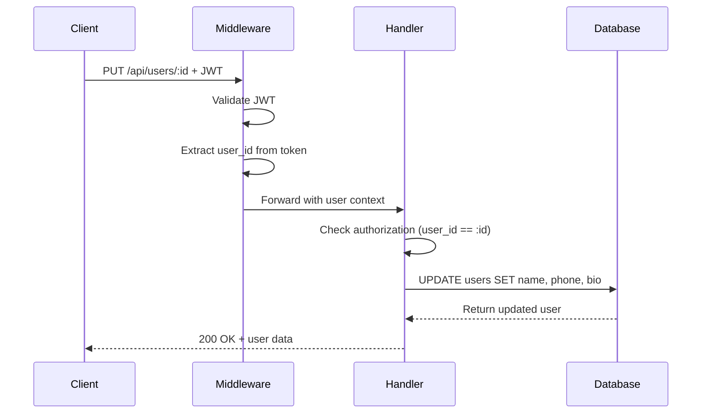
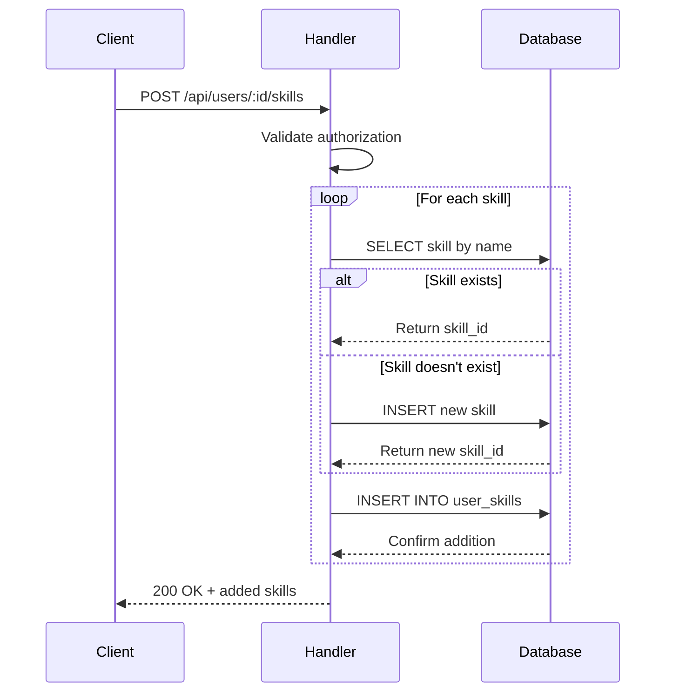
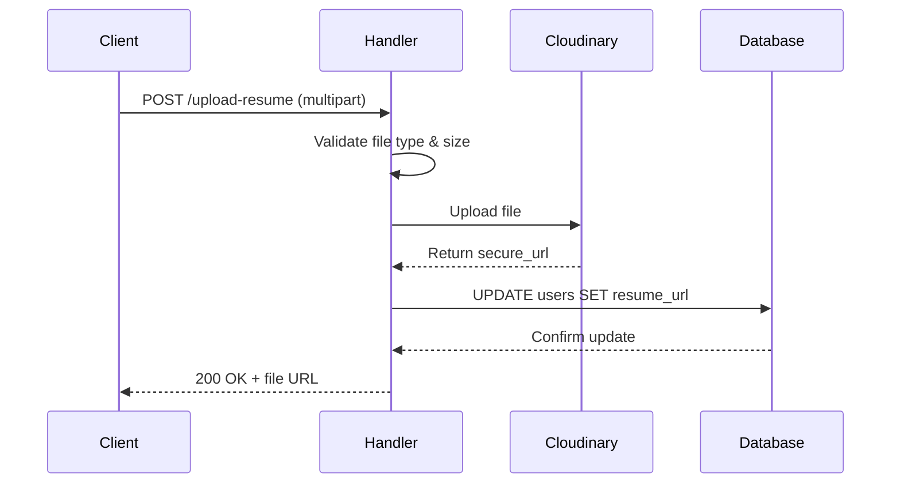

# User Service Documentation

## Overview

The User Service is a Golang-based microservice responsible for managing user profiles, skills, and file uploads in the job portal application. It provides RESTful APIs for profile management, skills CRUD operations, and secure file uploads to Cloudinary.

---

## Features

### ✅ Profile Management
- Get user profile by ID
- Update profile information (name, phone, bio)
- Authorization: Users can only access/modify their own profiles

### ✅ Skills Management
- Add multiple skills to user profile
- Auto-create skills if they don't exist
- Remove skills from profile
- Get all skills for a user
- Public skill search endpoint

### ✅ File Uploads
- Resume upload (PDF, DOC, DOCX - max 5MB)
- Profile picture upload (JPG, PNG, WebP - max 2MB)
- Cloudinary integration for CDN storage
- Automatic database URL updates

---

## Tech Stack

| Component | Technology |
|-----------|-----------|
| **Framework** | Gin (Go web framework) |
| **Database** | PostgreSQL (Neon DB) |
| **Authentication** | JWT middleware |
| **File Storage** | Cloudinary CDN |
| **Dependencies** | `lib/pq`, `golang-jwt/jwt/v5`, `cloudinary-go/v2` |

---

## API Endpoints

### Protected Endpoints (Requires JWT Token)

#### Profile Endpoints

**GET /api/users/:id**
- Get user profile
- Authorization: Own profile only

**Response:**
```json
{
  "id": "uuid",
  "name": "John Doe",
  "email": "john@example.com",
  "phone": "+1234567890",
  "role": "jobseeker",
  "bio": "Software developer...",
  "resume_url": "https://cloudinary.../resume.pdf",
  "profile_pic_url": "https://cloudinary.../pic.jpg"
}
```

**PUT /api/users/:id**
- Update profile information
- Authorization: Own profile only

**Request:**
```json
{
  "name": "John Doe Updated",
  "phone": "+0987654321",
  "bio": "Updated bio..."
}
```

#### Skills Endpoints

**POST /api/users/:id/skills**
- Add skills to user profile
- Auto-creates non-existent skills

**Request:**
```json
{
  "skills": ["JavaScript", "TypeScript", "React"]
}
```

**DELETE /api/users/:id/skills/:skillId**
- Remove skill from profile

**GET /api/users/:id/skills**
- Get all user skills

**Response:**
```json
[
  {
    "user_id": "uuid",
    "skill_id": "uuid",
    "skill_name": "JavaScript",
    "created_at": "2024-01-01T00:00:00Z"
  }
]
```

#### File Upload Endpoints

**POST /api/users/upload-resume**
- Upload resume file
- Content-Type: `multipart/form-data`
- Field name: `resume`
- Allowed types: PDF, DOC, DOCX
- Max size: 5MB

**POST /api/users/upload-profile-pic**
- Upload profile picture
- Content-Type: `multipart/form-data`
- Field name: `profile_pic`
- Allowed types: JPG, PNG, WebP
- Max size: 2MB

### Public Endpoints

**GET /api/skills?q=search_term**
- Search skills by name (case-insensitive)
- No authentication required
- Returns max 20 results

---

## Code Structure

```
user-service/
├── main.go                      # Entry point, router setup
├── config/
│   └── database.go             # PostgreSQL connection
├── middleware/
│   ├── auth.go                 # JWT validation
│   └── cors.go                 # CORS configuration
├── handlers/
│   ├── profile_handler.go      # GET/PUT profile
│   ├── skills_handler.go       # Skills CRUD
│   └── upload_handler.go       # File uploads
├── models/
│   └── user.go                 # Data models & DTOs
└── utils/
    └── cloudinary.go           # Cloudinary upload utility
```

---

## Request Flow

### Profile Update Flow



### Skills Addition Flow



### File Upload Flow



---

## Environment Variables

Required in `.env`:

```bash
# Database
DATABASE_URL=postgresql://...neon.tech/db?sslmode=require

# JWT Authentication
JWT_SECRET=your-secret-key

# Cloudinary
CLOUDINARY_CLOUD_NAME=your-cloud-name
CLOUDINARY_API_KEY=your-api-key
CLOUDINARY_API_SECRET=your-api-secret

# Server
USER_SERVICE_PORT=8002
```

---

## Security Features

### 🔒 Authorization
- **JWT Middleware**: All protected routes require valid JWT token
- **User Ownership**: Users can only access/modify their own data
- **Token Claims**: user_id, email, role extracted from JWT

### 🔒 Input Validation
- **File Type Validation**: Whitelist approach for uploads
- **File Size Limits**: Resume (5MB), Profile Pic (2MB)
- **SQL Injection Protection**: Parameterized queries
- **JSON Binding**: Gin's built-in validation

### 🔒 Data Privacy
- **Password Hash**: Never returned in API responses
- **CORS**: Configured to prevent unauthorized access

---

## Database Interactions

### Tables Used
- `users` - User profiles
- `skills` - Skills catalog
- `user_skills` - Many-to-many junction table

### Key Queries

**Profile Update:**
```sql
UPDATE users 
SET name = COALESCE(NULLIF($1, ''), name),
    phone = COALESCE(NULLIF($2, ''), phone),
    bio = COALESCE(NULLIF($3, ''), bio)
WHERE id = $4
```

**Add Skill (with conflict handling):**
```sql
INSERT INTO user_skills (user_id, skill_id)
VALUES ($1, $2)
ON CONFLICT (user_id, skill_id) DO NOTHING
```

---

## Running the Service

### Development

```bash
# Install dependencies
cd backend/user-service
go mod download

# Run service
go run main.go
```

Service starts on port **8002** (or `USER_SERVICE_PORT` from env)

### Build for Production

```bash
go build -o user-service
./user-service
```

---

## Testing Examples

### Using cURL

**Get Profile:**
```bash
curl -H "Authorization: Bearer <jwt-token>" \
  http://localhost:8002/api/users/{user_id}
```

**Add Skills:**
```bash
curl -X POST \
  -H "Authorization: Bearer <jwt-token>" \
  -H "Content-Type: application/json" \
  -d '{"skills": ["Go", "PostgreSQL"]}' \
  http://localhost:8002/api/users/{user_id}/skills
```

**Upload Resume:**
```bash
curl -X POST \
  -H "Authorization: Bearer <jwt-token>" \
  -F "resume=@/path/to/resume.pdf" \
  http://localhost:8002/api/users/upload-resume
```

---

## Error Handling

| Error Code | Description |
|------------|-------------|
| 400 | Bad Request - Invalid input or file format |
| 401 | Unauthorized - Missing or invalid JWT token |
| 403 | Forbidden - Not authorized to access resource |
| 404 | Not Found - User or skill not found |
| 500 | Internal Error - Database or Cloudinary failure |

---

## Integration with Other Services

### Auth Service
- Validates JWT tokens generated by auth service
- Uses same JWT_SECRET for token verification

### Utility Service
- File uploads go directly to Cloudinary
- URLs stored in database for retrieval

### Frontend
- NextAuth.js sends JWT in Authorization header
- File uploads use FormData with multipart/form-data

---

## Future Enhancements

- [ ] Skill proficiency levels (beginner, intermediate, expert)
- [ ] Profile completeness percentage
- [ ] Activity history tracking
- [ ] Batch skill operations
- [ ] Image transformations (Cloudinary)
- [ ] Resume parsing with AI
