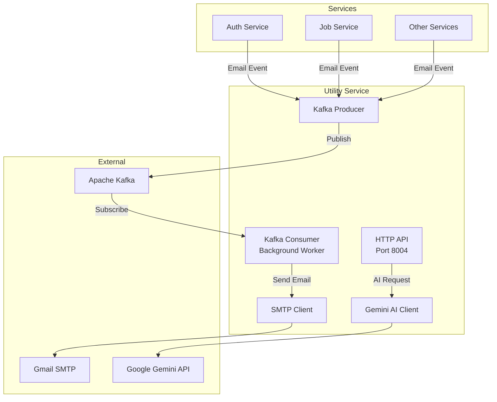
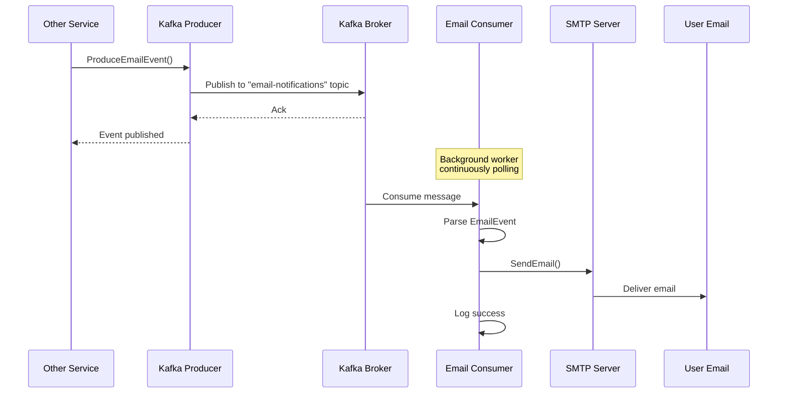

# Utility Service Documentation

## Overview

The Utility Service is a comprehensive microservice providing cross-cutting concerns for the job portal: **Kafka-based email notifications**, **Google Gemini AI integration** for career guidance and resume analysis, and utility functions. It runs a background Kafka consumer to process email events and exposes AI-powered endpoints.

---

## Features

### ✅ Kafka Email System
- **Producer**: Publishes email events to Kafka topic
- **Consumer**: Background worker consuming email events
- **SMTP Integration**: Sends emails via Gmail/SMTP
- **Event Types**: password-reset, application-submitted, status-changed

### ✅ AI-Powered Features (Google Gemini)
- **Career Guidance**: Personalized career advice based on skills, experience, goals
- **Resume Analysis**: ATS scoring and improvement suggestions
- **Job Market Insights**: AI-generated recommendations

### ✅ Infrastructure
- Background Kafka consumer running in goroutine
- JWT authentication for AI endpoints
- CORS support for frontend integration

---

## Tech Stack

| Component | Technology |
|-----------|-----------|
| **Framework** | Gin (Go web framework) |
| **Message Queue** | Apache Kafka |
| **Kafka Client** | segmentio/kafka-go |
| **AI** | Google Gemini (generative-ai-go) |
| **Email** | SMTP (net/smtp) |
| **Authentication** | JWT middleware |

---

## Architecture



---

## API Endpoints

### Protected AI Endpoints (Require JWT)

#### POST /api/ai/career-guide
Get personalized career guidance powered by Google Gemini

**Request:**
```json
{
  "skills": ["JavaScript", "React", "Node.js"],
  "experience": "3 years as full-stack developer at tech startup",
  "goals": "Transition into senior engineering role at FAANG company"
}
```

**Response:**
```json
{
  "guidance": "Based on your profile...\n\n1. Suitable Career Paths:\n- Senior Full Stack Engineer\n- Tech Lead\n...\n\n2. Skills to Develop:\n- System design\n- Distributed systems\n..."
}
```

#### POST /api/ai/resume-analyze
Analyze resume against job description with ATS scoring

**Request:**
```json
{
  "resume_text": "John Doe\nSoftware Engineer\n\nExperience:\n...",
  "job_description": "We are looking for a Senior Backend Engineer with 5+ years..."
}
```

**Response:**
```json
{
  "analysis": "{\n  \"ats_score\": 78,\n  \"strengths\": [...],\n  \"weaknesses\": [...],\n  \"missing_keywords\": [...],\n  \"suggestions\": [...]\n}"
}
```

### Email Testing Endpoint

#### POST /api/email/send
Manually trigger email via Kafka (for testing)

**Request:**
```json
{
  "to": "user@example.com",
  "subject": "Test Email",
  "body": "This is a test email from the job portal.",
  "type": "manual"
}
```

**Response:**
```json
{
  "message": "Email event sent to Kafka successfully"
}
```

---

## Code Structure

```
utility-service/
├── main.go                     # Entry point, starts consumer in background
├── kafka/
│   ├── producer.go            # Kafka producer for email events
│   └── consumer.go            # Background consumer processing emails
├── email/
│   └── smtp.go                # SMTP email sender
├── ai/
│   └── gemini.go              # Google Gemini AI integration
├── handlers/
│   ├── ai_handler.go          # AI endpoints
│   └── email_handler.go       # Email testing endpoint
└── middleware/
    ├── auth.go                # JWT validation
    └── cors.go                # CORS configuration
```

---

## Kafka Email Flow

### Event Publishing Flow



### Email Event Model

```go
type EmailEvent struct {
    To      string `json:"to"`
    Subject string `json:"subject"`
    Body    string `json:"body"`
    Type    string `json:"type"` // password-reset, application-submitted, etc.
}
```

### Usage Example (from other services)

```go
import "github.com/job-portal/utility-service/kafka"

// In auth service - password reset
event := kafka.EmailEvent{
    To:      user.Email,
    Subject: "Password Reset Request",
    Body:    fmt.Sprintf("Your reset token is: %s", token),
    Type:    "password-reset",
}
kafka.ProduceEmailEvent(event)

// In job service - application submitted
event := kafka.EmailEvent{
    To:      recruiter.Email,
    Subject: "New Application Received",
    Body:    fmt.Sprintf("%s applied to %s", applicant, jobTitle),
    Type:    "application-submitted",
}
kafka.ProduceEmailEvent(event)
```

---

## AI Integration (Google Gemini)

### Career Guidance

Uses **Gemini Pro** model to generate personalized career advice:

**Capabilities:**
- Analyzes skills and experience
- Suggests career paths
- Recommends learning resources
- Provides job market insights
- Actionable next steps

**Example Response:**
```
Based on your profile with JavaScript, React, and Node.js skills
and 3 years of experience:

1. Suitable Career Paths:
   - Senior Full Stack Engineer
   - Frontend Architect
   - Technical Lead

2. Skills to Develop:
   - System design and architecture
   - Kubernetes and cloud platforms
   - Performance optimization
   - Team leadership

3. Learning Resources:
   - System Design Interview courses
   - AWS/GCP certifications
   - Open source contributions

4. Job Market Insights:
   - High demand for full-stack engineers
   - Avg salary: $120k-$180k
   - Remote opportunities abundant

5. Next Steps:
   - Build a scalable side project
   - Practice system design interviews
   - Network with senior engineers
```

### Resume Analysis

ATS (Applicant Tracking System) scoring with feedback:

**Analysis Criteria:**
- Keyword matching with job description
- Skills alignment
- Experience relevance
- Resume structure
- Missing qualifications

**Output:**
- ATS Score (0-100)
- Strengths list
- Weaknesses to address
- Missing keywords
- Specific improvement suggestions

---

## Environment Variables

Required in `.env`:

```bash
# Kafka Configuration
KAFKA_BROKER=localhost:9092
KAFKA_EMAIL_TOPIC=email-notifications
KAFKA_GROUP_ID=email-consumer-group

# SMTP Configuration (Gmail example)
SMTP_HOST=smtp.gmail.com
SMTP_PORT=587
SMTP_USER=your-email@gmail.com
SMTP_PASSWORD=your-app-password

# Google Gemini AI
GEMINI_API_KEY=your-gemini-api-key

# JWT Secret
JWT_SECRET=your-secret-key

# Server
UTILITY_SERVICE_PORT=8004
```

---

## Setup Instructions

### 1. Kafka Setup

Make sure Kafka is running via Docker Compose:

```bash
cd docker
docker-compose up -d
```

This starts:
- Zookeeper (port 2181)
- Kafka (port 9092)

### 2. Gmail SMTP Setup

To use Gmail as SMTP server:

1. Enable 2-factor authentication on your Google account
2. Generate an **App Password**:
   - Go to Google Account → Security → 2-Step Verification → App passwords
   - Create password for "Mail"
3. Use app password in `.env`:
   ```bash
   SMTP_USER=youremail@gmail.com
   SMTP_PASSWORD=your-16-char-app-password
   ```

### 3. Google Gemini API Key

1. Go to https://ai.google.dev/
2. Click "Get API Key"
3. Create new project or use existing
4. Copy API key to `.env`:
   ```bash
   GEMINI_API_KEY=AIza...
   ```

---

## Running the Service

### Development

```bash
cd backend/utility-service
go mod download
go run main.go
```

**Console output:**
```
✅ Google Gemini AI client initialized
✅ Kafka producer initialized (broker: localhost:9092, topic: email-notifications)
✅ Kafka consumer started (group: email-consumer-group, topic: email-notifications)
🚀 Utility Service starting on port 8004
📧 Kafka email consumer running in background
```

### Production Build

```bash
go build -o utility-service
./utility-service
```

---

## Testing Examples

### Test Career Guidance

```bash
curl -X POST \
  -H "Authorization: Bearer <jwt-token>" \
  -H "Content-Type: application/json" \
  -d '{
    "skills": ["Python", "Django", "PostgreSQL"],
    "experience": "2 years backend development",
    "goals": "Become a backend architect"
  }' \
  http://localhost:8004/api/ai/career-guide
```

### Test Resume Analysis

```bash
curl -X POST \
  -H "Authorization: Bearer <jwt-token>" \
  -H "Content-Type: application/json" \
  -d '{
    "resume_text": "Software Engineer with 5 years experience in React, Node.js...",
    "job_description": "Looking for Senior Full Stack Engineer with React and Node.js..."
  }' \
  http://localhost:8004/api/ai/resume-analyze
```

### Test Email via Kafka

```bash
curl -X POST \
  -H "Content-Type: application/json" \
  -d '{
    "to": "test@example.com",
    "subject": "Test Notification",
    "body": "This is a test email from Kafka consumer.",
    "type": "test"
  }' \
  http://localhost:8004/api/email/send
```

**Check logs to see:**
```
📧 Email event produced: test to test@example.com
📬 Processing email event: test to test@example.com
✅ Email sent successfully to test@example.com
```

---

## Integration with Other Services

### Auth Service Integration

In `auth-service/handlers/auth_handler.go`:

```go
import "github.com/job-portal/utility-service/kafka"

// In ForgotPassword handler
event := kafka.EmailEvent{
    To:      user.Email,
    Subject: "Password Reset Request",
    Body:    fmt.Sprintf("Reset your password using: %s", resetToken),
    Type:    "password-reset",
}
kafka.ProduceEmailEvent(event)
```

### Job Service Integration

In `job-service/handlers/application_handler.go`:

```go
// When application is submitted
event := kafka.EmailEvent{
    To:      recruiterEmail,
    Subject: "New Job Application",
    Body:    fmt.Sprintf("%s applied to %s position", applicantName, jobTitle),
    Type:    "application-submitted",
}
kafka.ProduceEmailEvent(event)

// When status changes
if application.Subscribed {
    event := kafka.EmailEvent{
        To:      applicantEmail,
        Subject: "Application Status Update",
        Body:    fmt.Sprintf("Your application status: %s", newStatus),
        Type:    "status-changed",
    }
    kafka.ProduceEmailEvent(event)
}
```

---

## Error Handling

| Error Code | Scenario |
|------------|----------|
| 400 | Invalid request data, missing required fields |
| 401 | Missing or invalid JWT token (AI endpoints) |
| 500 | Kafka connection failure, SMTP error, Gemini API error |

### Common Issues

**Kafka connection refused:**
```
Failed to produce email event: dial tcp: connection refused
```
**Solution:** Ensure Kafka is running (`docker-compose up -d`)

**SMTP authentication failed:**
```
Failed to send email: 535 Authentication failed
```
**Solution:** Verify SMTP credentials, use app password for Gmail

**Gemini API error:**
```
Failed to generate career guidance: API key not valid
```
**Solution:** Check `GEMINI_API_KEY` in `.env`

---

## Monitoring & Logs

### Log Patterns

**Successful email flow:**
```
📧 Email event produced: password-reset to user@example.com
📬 Processing email event: password-reset to user@example.com
✅ Email sent successfully to user@example.com
```

**Failed email:**
```
📬 Processing email event: test to invalid@example.com
Failed to send email: 550 No such user
```

### Production Considerations

- [ ] **Dead Letter Queue**: Handle failed emails
- [ ] **Retry Logic**: Implement exponential backoff
- [ ] **Rate Limiting**: Prevent email spam
- [ ] **Monitoring**: Prometheus metrics for Kafka lag
- [ ] **Logging**: Structured logging (logrus/zap)
- [ ] **Circuit Breaker**: For SMTP failures

---

## Performance

### Kafka Consumer
- Runs in background goroutine
- Continuously polls for messages
- Processes emails asynchronously
- Non-blocking to main API server

### AI Requests
- Gemini API calls have ~2-5s latency
- Timeout configured at 30s (default)
- Consider caching for repeated queries

### SMTP
- Email sending is ~1-3s per email
- Sequential processing (one at a time)
- For high volume, implement worker pool

---

## Future Enhancements

- [ ] **Email Templates**: HTML email templates with Handlebars
- [ ] **Batch Emails**: Send multiple emails in one request
- [ ] **Email Tracking**: Open rates, click tracking
- [ ] **Advanced AI**: Job matching algorithm, salary prediction
- [ ] **Webhook Support**: External integrations
- [ ] **SMS Notifications**: Twilio integration
- [ ] **Push Notifications**: Firebase Cloud Messaging

---

Service is production-ready for core features! 🚀
